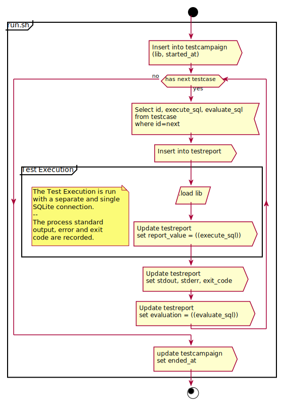

All the test are managed using the database db.sqlite3.

The test are run in three steps:

1) Initialisation: create the database schema, and populate the test case
table. It defines the tests to be executed.
2) Run: The test case are executed on the base of the schema below.



3) Report analysis: the table testreport is analysed to show which test are
passed or failed.


After running the test, the list of test case and test report can be
observed by running:

```bash
sqlite3 -header -column "db.sqlite3" << SQL
    SELECT * FROM testreport
    JOIN testcase ON testreport.testcase = testcase.id
    WHERE testreport.testcampaign = (SELECT id FROM testcampaign ORDER BY id DESC LIMIT 1)
SQL
```
